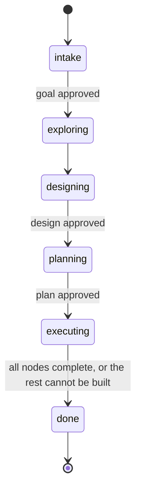
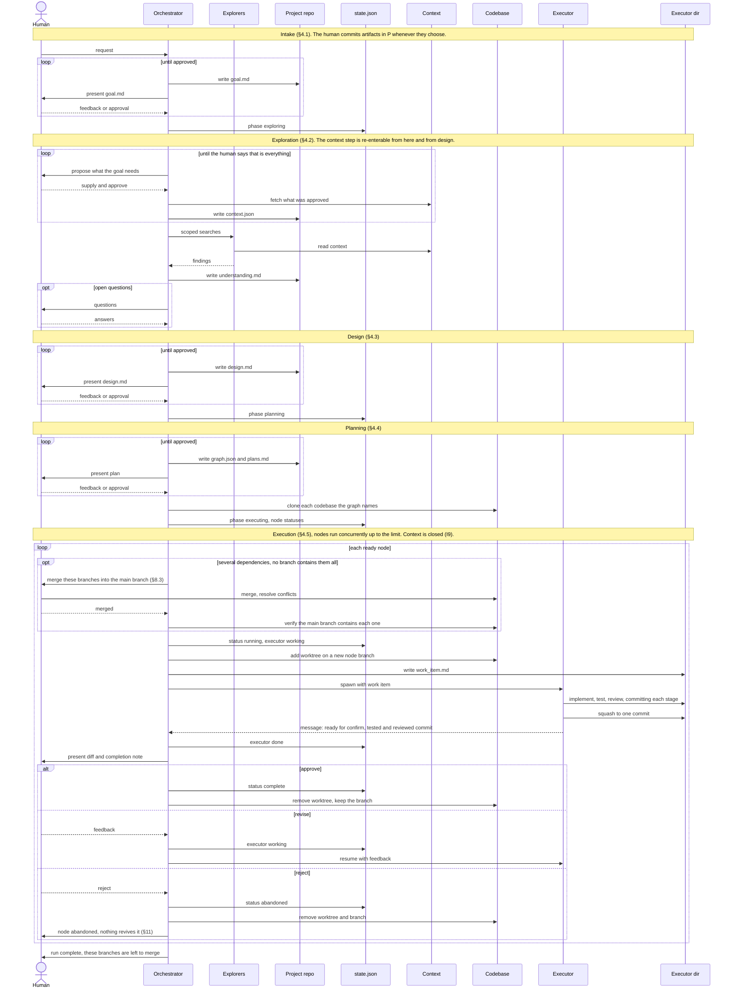
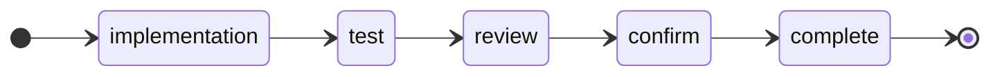
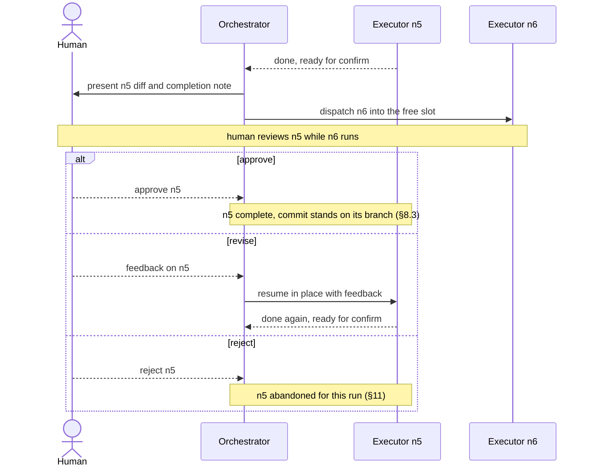

# devflow — Orchestrated Development Flow

A two-role agent architecture for taking a request from intent to landed code, with
durable state, explicit human gates, and parallel execution of independent work.

Status: **design, not implemented.** This document defines the architecture and the
contracts between components. How those components are built on Claude Code is in
[`harness.md`](./harness.md); what remains undecided is in [Open Questions](#12-open-questions).

---

## 1. Purpose

Long agent sessions fail in predictable ways: context is rebuilt from scratch on every
resume, the human approves a direction and then watches the agent drift from it, and a
single sprawling diff arrives at the end that nobody can meaningfully review.

devflow addresses those three failures with three mechanisms:

| Failure | Mechanism |
|---|---|
| Context evaporates between sessions | Every phase writes a durable artifact to disk |
| Agent drifts from the agreed direction | Every phase transition waits on explicit human approval |
| One unreviewable diff at the end | Work is decomposed into a graph of independently reviewable nodes |

This design complements, and does not replace,
[`implementation.md`](../../ai-artifacts/instructions/implementation.md). That document
already defines how a single code change must be made — scope discipline, tests within
scope, self-review, human approval on the full diff, and the human performing the commit.
devflow is the *scheduler* around that document: an Executor's lifecycle is
`implementation.md` turned into a state machine, and the Orchestrator decides which
changes exist and in what order.

---

## 2. Roles

### Orchestrator

One per project. Long-lived. The only agent that talks to the human.

Owns: the goal, context, design, the work graph, scheduling, and run state.

**Does not write production code or git history.** Its only writes are the project
artifacts (§9), `.devflow/state.json`, each node's `work_item.md`, provisioning context and
working clones the human has approved (§4.2, §4.4), and provisioning Executor
directories (adding a worktree and its branch, removing them once the node is complete).
This is the central invariant — it keeps the Orchestrator's context budget spent on
coordination rather than implementation detail, and it means every line of production code
has passed through a node's review and confirm gates.

It **never authors a change** to a codebase checkout at `.devflow/repos/<repo>/` (I8). It may
fast-forward one to pick up a merge the human made (§8.3), and that is all. Node branches and
their commits do accumulate in the repository that checkout owns — that is where every node's
worktree hangs from (§8.1).

### Executor

One per work node. Ephemeral, headless, no channel to the human. The Orchestrator spawns it
as a subagent and hands it the node's work item, which names its scratch directory — the
work item plus a worktree of exactly one codebase, on a branch of its own (§8.1). How it is
built, and how far its confinement goes, is in [`harness.md`](./harness.md).

Owns: the implementation of exactly one node, and driving it through test and review. It
writes the code itself; for the test and review stages it starts a fresh **tester** and a
fresh **reviewer**, so tests are not self-reported and review is not self-review (§6).

**Commits on its own branch, and nowhere else.** It commits each stage of its loop as it
goes, which is what makes the stage durable (§6), and squashes to one commit before it
reports (§7.1). It does not merge, rebase onto anything but its own base, push, or touch
another node's branch.

**Does not re-plan or touch other nodes.** An Executor that concludes its work item is wrong
escalates to the Orchestrator rather than improvising a better plan.

Its only message to the Orchestrator is its completion status — ready for confirm, or
blocked (§7.1). It has no other channel and writes no artifact outside its scratch
directory.

### Human

Initializes the project: creates the project repository (§9). **Decides what context the run
gets** — the Orchestrator proposes, they supply and approve (§4.2). Approves the goal, the
design, and the plan. Reviews each node's diff at its confirm gate.

**Owns everything that reaches a shared branch.** Commits the Orchestrator's artifacts in
the project repository. In the codebases, merges node branches into the main branch at the
checkpoints devflow asks for (§8.3) and at the end of the run, resolving any conflicts, by
whatever git flow they choose — local merge, pull request, stacked pull requests. devflow
stops at the node branch and never pushes.

---

## 3. Invariants

These are the properties a correct implementation must preserve. Most of the design
below follows from them.

- **I1.** The Orchestrator never edits production code.
- **I2.** Exactly one writer per file. `state.json` and `work_item.md` are
  Orchestrator-only; an Executor writes only inside its own scratch directory. No locking is required
  because no file has two writers.
- **I3.** No phase advances without explicit human approval, and no phase is revisited once
  it has one. The phase itself is the record: the Orchestrator never moves on from a gate it
  has not been told to pass, and never moves back through one it has.
- **I4.** An Executor owns exactly one node, one scratch directory and one branch. It edits
  no file outside its worktree and touches no ref but its own branch. For the MVP this is
  held by instruction, not enforced by the harness; stronger isolation is available when
  needed (harness.md §4, §7).
- **I5.** State is durable *before* the action it authorizes (write-ahead). A crash
  between "wrote intent to spawn" and "spawned" is recoverable; the reverse is not.
- **I6.** An Executor that finds its work item wrong escalates rather than improvising a
  better plan. The graph does not change in response: the node is blocked, and re-planning
  waits for a new run.
- **I7.** No agent writes history on a shared branch. An Executor commits only to its own
  node branch; nothing devflow runs merges into the main branch, pushes, or opens a pull
  request. Everything that reaches a shared branch is the human's own act (§8.3).
- **I8.** devflow never *authors* a change to a codebase checkout at `.devflow/repos/<repo>/`.
  It does not edit the working tree, switch branches, commit, merge, or resolve divergence
  there. The one way the checkout advances is a fast-forward to a merge the human already made
  (§8.3). Node branches and objects accumulate in the repository behind it, which is expected
  and is not a change to the checkout.
- **I9.** Context is read-only, never a node's target, and frozen before execution. Nothing
  devflow runs writes to `.devflow/context/`; no node may name a reference as its `repo`; and
  once the phase is `executing` no context is added, because by then everything it held has been
  distilled into `understanding.md` (§4.2).

---

## 4. Run Lifecycle

A **run** is one pass through this lifecycle, from intake to `done`, for one approved
goal. It has one goal, design, and work graph, and one `state.json`. Each phase's output is
frozen when the human approves it: a run never returns to an earlier phase, and work that turns
out to need a different plan waits for a new run (§11). A project has exactly one run (§12).



Each gated phase (intake, design, planning) iterates with the human until approval; those
loops are omitted from the diagram. **They are the only loops.** Once a phase's output is
approved it is frozen, and the run never returns to it: a later phase that finds the goal,
the understanding, the design or the graph wrong says so and the run ends. Nothing is
rewritten behind an approval the human already gave.

### 4.1 Intake

The human describes what needs to be done. The Orchestrator restates it as `goal.md` and
iterates with the human until they agree. Cheap, and it catches the most expensive class
of error — building the wrong thing — before any tokens are spent on exploration.

`goal.md` states:

- the request, in the Orchestrator's own words
- what "done" looks like, concretely enough to check at the end of the run
- known constraints (compatibility, systems that must not change, deadlines)
- what is explicitly out of scope

**Gate: the human approves `goal.md` explicitly.** The phase advances to `exploring` only
on that approval; exploration does not begin until then.

Output: `goal.md`.

### 4.2 Exploration

Two steps: establish what there is to read, then read it.

#### 4.2.1 Gathering context

The Orchestrator cannot explore what it has not been given, and a run built on missing context
produces a design that is wrong in ways nobody notices until execution. So before reading
anything it works out what the approved goal needs, proposes it, and waits for the human to
supply it.

Two kinds of thing are declared, and the distinction runs through the rest of the design:

| | Working codebase | Reference |
|---|---|---|
| What it is for | work will happen here | read in order to understand |
| Must be a git repository | yes | no |
| Can be named as a node's `repo` | yes | **never** |
| Written by devflow | later, through a node's worktree | never (I9) |

**Everything declared is fetched into `.devflow/context/<name>/`, and that is what exploration
reads** — including the codebases the work will change. Which of them actually get changed is not
known until the graph exists, so nothing is cloned for work at this step. At plan approval the
codebases the graph names *additionally* get a fresh working clone at `.devflow/repos/<name>/`
(§4.4, §8.1); the context copy stays where it is and stays read-only.

So a codebase that gets worked on ends up on disk twice, on purpose. §8.1 explains why: a context
resource is whatever the human pointed at, and a base commit taken from that means nothing.

**Declaring something as a codebase is checked when it is fetched.** It has to be a git
repository, because everything downstream needs a branch and a commit. A `codebases` entry whose
source cannot be cloned is an error to raise here, while the human is still in the conversation —
not at plan approval, by which point a whole design has been built on it.

The Orchestrator **proposes; the human decides.** It has the goal, and a codebase's README or
dependency manifest names neighbours worth reading, so it should say what it thinks is missing
and why. It does not choose — a run whose context an agent selected is a run that can quietly
omit the thing that mattered. Fetching is the human's call too, since it reaches the network:
devflow may clone or copy what the human approved, and nothing else.

Output: `context.json` at the project root, committed by the human.

```jsonc
{
  "codebases": [
    {
      "name": "api",
      "source": "git@github.com:acme/api.git",
      "what": "The service this work changes. Only these may be a node's repo."
    }
  ],
  "references": [
    {
      "name": "billing",
      "source": "git@github.com:acme/billing-service.git",
      "what": "api calls this for invoicing. We must understand it and must not change it."
    },
    {
      "name": "rfc-041",
      "source": "~/docs/rfc-041-auth.md",
      "what": "The spec the new auth flow has to match."
    }
  ]
}
```

`name` is the directory under `.devflow/`. `source` records where it came from, which is what
lets a different checkout re-provision the same context (§9). `what` is one line on what the
thing is and why it is here — it is read by every later phase, so "the billing service" is not
enough and "api calls this for invoicing, must not change" is.

**The file is committed; the content is not.** `.devflow/` is gitignored, so the material itself
is machine-local — but the declaration travels with the project, which is the only durable record
of what a run was based on. Without it, a reader of `understanding.md` cannot tell whether a gap
is an oversight or an absence.

**This step is re-enterable.** Exploration frequently discovers that something else has to be
read, and design sometimes does too; either may come back here, propose the addition, and
continue once the human supplies it. Coming back from design means appending what the new material
changes to `understanding.md` rather than rewriting it (§9) — the point of the append-only record
is that a later reader can see the belief change.

**A reference can be promoted to a codebase**, and this is a normal thing to happen: design
concludes that the neighbouring service has to change after all. The human re-declares it under
`codebases`, and it gets a working clone at plan approval like any other. It cannot go the other
way once the graph names it. Promotion has to happen before the plan is approved, because
validation rejects a node whose `repo` is not a declared codebase (§5.3) and the graph is frozen
after that.

What this step may not do is run during execution — see I9 and §4.5.

#### 4.2.2 Reading it

The Orchestrator reads the declared context and writes down what it learned. Fan-out search
agents are appropriate here; their findings are distilled into the document, not pasted into it.

Exploration is scoped by the approved goal, not exhaustive. The aim is enough context to
design, not a map of every codebase.

Output: `understanding.md` — what each declared thing is and how it matters, architecture as
it actually is, relevant conventions, constraints discovered, and **open questions**.
Open questions are first-class; an unanswered one is a reason to talk to the human, not
to guess.

`context.json` says what was available; `understanding.md` says what it means. They are kept
apart for the same reason `graph.json` and `plans.md` are: one is checked by machine, the other
is read by a person.

### 4.3 Design

The Orchestrator proposes a high-level design and iterates with the human. The design
answers *what* changes and *why*, and explicitly names what is out of scope.

A design is complete when it states: the approach, the alternatives rejected and why,
the components affected, the new or changed interfaces, and the non-goals.

**Gate: the human approves `design.md` explicitly.** The phase advances to `planning` only
on that approval (I3).

Output: `design.md`.

### 4.4 Planning

The Orchestrator decomposes the approved design into a directed acyclic graph of work
nodes. Node contract and sizing rules are in §5.

Planning **consumes** context and does not add to it. A plan that cannot be written without
something nobody declared means exploration or the design missed it, and that is a later phase
finding an earlier output wrong — the run ends rather than quietly widening its inputs (§4).

The plan is presented to the human in two forms: `plans.md` for reading, `graph.json` for
machines. They must agree; `plans.md` is generated from `graph.json`.

**Gate: the human approves the plan explicitly.** The phase advances to `executing` only
on that approval.

**On approval — after validation (§5.3) passes — the working codebases are provisioned.** The
set is read off the approved graph, being the distinct `repo` values across all its nodes, rather
than guessed at. devflow makes a fresh clone of each into `.devflow/repos/<name>/` from the source
`context.json` declares (§8.1). A declared codebase that no node targets is never cloned: it stays
a reference and is read where it is.

Output: `plans.md`, `graph.json`, and a working clone per codebase the graph names.

### 4.5 Execution

The Orchestrator schedules ready nodes, spawns Executors, relays confirm gates to the
human, asks for a merge at the checkpoints the graph requires, and persists state after
every transition. Detail in §6–§8.

**Context is closed.** No reference is added and none is re-read: everything they held is in
`understanding.md` by now, and an Executor sees only its work item and its own worktree (§6). A
belief that turns out wrong at this point is a correction to `understanding.md` and, if it
invalidates a node, a `blocked` node — not a reason to go back and read more (I9).

### 4.6 Interaction Flow

End-to-end interactions across every participant in a run.

| Participant | What it is |
|---|---|
| Human | Approves gates, reviews diffs, merges node branches at checkpoints |
| Orchestrator | Coordinating agent; sole channel to the human |
| Explorers | Short-lived search agents fanned out during exploration |
| Project repo | The project directory; checked-in artifacts (§9) |
| `state.json` | Run state, in `.devflow/` |
| Context | Read-only material under `.devflow/context/`, declared in `context.json` (§4.2) |
| Codebase | The working clone at `.devflow/repos/<repo>/` and the repository behind it, which owns every node branch and worktree |
| Executor | Per-node implementing agent |
| Executor dir | The node's work item and its worktree, in `.devflow/executors/` |



---

## 5. The Work Graph

### 5.1 Node contract

The graph lives in `graph.json` at the project root: a list of nodes, nothing else. There is
no version field — the human commits the file, so git already records what the graph was and
when it changed. Each node declares:

| Field | Purpose |
|---|---|
| `id` | Lowercase letters, digits and hyphens. Stable for the run, never reused even after `abandoned`; also the Executor directory name |
| `repo` | The one codebase this node changes. Must be a `codebases` entry in `context.json` — never a reference (I9) |
| `title` | One line, imperative |
| `intent` | What changes and why, in prose. The core of the Executor's work item. |
| `depends_on` | Node ids whose work must be committed and reachable from this node's base before it starts (§5.3) |
| `files_touched` | Predicted paths/globs within `repo`. Used for sibling scheduling (§8.2), not enforcement. |
| `acceptance` | Verifiable criteria. "The endpoint returns 409 on duplicate email", not "auth works". |
| `tests` | How to verify the node: which tests or suites are relevant and how to run them, as guidance in prose. The tester chooses the exact commands. What tests to *write* follows from `acceptance`, and is the Executor's call |
| `gate` | `manual` (default) or `auto` — see §12 |

```jsonc
{
  "nodes": [
    {
      "id": "n3",
      "repo": "api",
      "title": "Extract token verification into AuthVerifier",
      "intent": "Token verification is inlined in three middleware functions with drifting behavior. Extract a single AuthVerifier class in src/auth/verifier.ts and have all three call it. No behavior change intended.",
      "depends_on": ["n1"],
      "files_touched": ["src/auth/verifier.ts", "src/auth/middleware/*.ts"],
      "acceptance": [
        "All three middleware paths call AuthVerifier.verify()",
        "An expired token yields 401 with code TOKEN_EXPIRED on all three paths"
      ],
      "tests": "The auth tests are the relevant ones (npm test -- src/auth). Run the full middleware suite too, since all three middleware paths change.",
      "gate": "manual"
    }
  ]
}
```

### 5.2 Sizing rules

A node must be **reviewable, verifiable, and incremental**. Concretely:

- **Reviewable** — one human can hold the whole diff in their head. Heuristic: ≲400
  changed lines across ≲5 files. Past that, split.
- **Verifiable** — the acceptance criteria can be checked by running something. A node
  whose criteria can only be assessed by opinion is under-specified.
- **Incremental** — the codebase is in a working state after the node lands. A node
  that leaves the build broken pending a sibling is not a node; it and its sibling are
  one node.
- **Single-repo** — a node changes exactly one codebase. A change that spans codebases is
  several nodes linked by `depends_on`.

**Splitting test:** if the node's title needs the word "and", or a reviewer would have to
mentally sort the diff into categories, split it. This is the same heuristic
`implementation.md` applies to a logical scope, because a node *is* a logical scope.

### 5.3 Graph rules

- **Validated at plan approval.** The plan is rejected if the dependencies contain a cycle,
  a dependency names an unknown id, an id is duplicated, a `repo` is not declared under
  `codebases` in `context.json`, or a node has no acceptance criteria.
- **`repo` is validated against the manifest, not against the disk.** Working clones do not exist
  until the plan is approved (§4.4), so there is no directory to check. Naming a `references`
  entry is the error this catches: reference material is read, never changed (I9), and a node
  pointed at it could never be built.
- `depends_on` means **every dependency is `complete`, and the commit this node branches from
  contains all of their work.** A node's worktree is created on a new branch off that commit,
  so it starts out already containing its dependencies and never re-does or conflicts with
  them.
- **One dependency: no ceremony.** The dependency's branch tip *is* the base. The graph
  becomes a chain of branches, each stacked on the one before, and nothing has to reach the
  main branch for work to keep moving.
- **Several dependencies: a checkpoint.** Two dependency branches that have diverged have no
  single commit containing both, so there is no base to branch from. The Orchestrator stops,
  names the branches, and asks the human to merge them into the main branch. Once they have,
  the main branch is the base. §8.3 covers the verification.
- Nodes whose dependencies are all `complete` are `ready`. A `ready` node still waiting on a
  checkpoint merge is not yet dispatchable (§8.2).

---

## 6. Executor Lifecycle



The Executor does the implementation itself. The test and review stages are each performed
by an agent the Executor starts fresh for that stage, and which cannot change the code:

| Stage | Performed by | Can change code |
|---|---|---|
| implementation | the Executor | yes |
| test | a new **tester** | no — instructed not to |
| review | a new **reviewer** | no — has no tool that can |

The diagram shows the path to completion. Off that path:

| From | Back to `implementation` when | Budget | When exhausted |
|---|---|---|---|
| test | tests fail | 3 | `blocked` |
| review | the reviewer has findings | 2 | `blocked` |
| confirm | the human requests revisions | none | — |

**Every return to `implementation` means testing and reviewing again.** An edit invalidates
the tested commit, so no stage can be skipped on the way back to confirm.

An Executor also ends `blocked` if it finds its work item wrong (I6), and `abandoned` if
the human rejects the node outright at confirm.

### The commit at each stage

The Executor commits to its branch every time it finishes editing, before it starts a tester
or a reviewer. Two things depend on it:

- **Each stage becomes durable.** A replacement Executor after a crash reads `git log` and
  sees how far the work got, rather than inferring it from a working tree (§10).
- **The commit identifies what was checked.** The tester and the reviewer are each told which
  commit they are looking at and each name it in their report. The Orchestrator compares each
  one's *content* against the branch tip before it presents anything to the human, so an edit
  made after review is caught rather than assumed away (§7.2).

### implementation
The Executor makes the change described by the work item, plus the tests that verify it, and
commits it. Scope is the node and nothing else — discoveries outside it are reported, not
fixed (`implementation.md` §1). On later rounds it works from the test failure, the review
findings, or the human's feedback that sent it back.

### test
The Executor starts a new tester, giving it the commit under test, the node's `tests` guidance
and, from the second round on, the commands the previous tester ran. The tester decides what to
run — at least what the previous round covered — then:

1. runs its chosen tests;
2. reports pass or fail with **the exact commands it ran** and their output, the commit it
   tested, and whether the run left the tree dirty.

A run that writes into the tree it is measuring — build artifacts, caches, output files — is
itself a failure: the result cannot be trusted, and the project needs to ignore its artifacts
before the node can be verified. The tester changes nothing. Listing the commands keeps its freedom accountable: "tests
passed" always says what was run. A failing test is investigated and fixed by the Executor,
never disabled or weakened.

### review
The Executor starts a new reviewer, which has no tool that can change files. It reviews the
full diff against correctness, scope discipline, readability, test quality, leftovers, and
consistency (`implementation.md` §4), and reports findings and the commit it reviewed. On later
rounds it is also given the earlier findings, to check they were addressed. The Executor fixes
findings within scope; findings that require leaving scope are escalated.

### confirm
The Executor **squashes its branch to a single commit** — the node is one logical scope
(§5.2), so it is one commit — writes the message itself, and stops, reporting the tester's
result, the reviewer's result, and the commit. It cannot reach the human itself; the
Orchestrator relays (§7).

The message is the Executor's to write and is not part of what the human approves. At this point
the branch is still disposable — nothing is built on it and it has not been approved — so a poor
message costs a rewrite rather than a bad entry in shared history, and the human can improve it
when they merge.

On revision feedback it re-enters `implementation` with that feedback, as many times as the
human wants, squashing again each time it comes back round. Rewriting the branch is safe
because no dependent branches from it until the node is `complete`. On outright rejection the
node is `abandoned` and the Orchestrator records it as finished for this run (§11).

### complete
The human approved at confirm. The node's single commit stands on its branch, ready for a
dependent to build on or for the human to merge (§8.3). The Executor is finished.

---

## 7. The Confirm Relay

### 7.1 Mechanism



**How the Executor signals.** It finishes, and its final message reports its completion status: the outcome
(`confirm` or `blocked`) and a **completion note** — a few lines covering the commands the
tester ran and their result, the reviewer's result, the commit both of them checked, and
anything the human must know to review the diff. That is the Executor's
only channel; its durable output is the commit on its branch, and it writes no artifact of its
own. Mechanics: harness.md §3.

The Orchestrator records `executor: done` in `state.json`, then presents the diff and the
note to the human. The diff is read from the branch, so the Orchestrator's context is not
spent on implementation detail (§2). The note itself is not persisted — but unlike an earlier
version of this design, what it describes is: after a restart the branch still carries the
commit, so the diff is re-presented from the same place (§10).

Nothing is reported while working — completion is the only signal. So the
Orchestrator cannot see inside a running Executor, which is why it tracks only `working` or
`done` rather than the Executor's internal phases (§6). It also means a crash loses nothing
that has to be recovered: a respawned Executor reads its branch and picks up from the last
committed stage (§10).

On revision the Executor is resumed with a message and keeps its context: it remembers work
that appears nowhere on disk. Restarting it from cold would discard everything it learned
implementing the node, which is why the relay resumes rather than respawns. The tester and
reviewer, by contrast, are always started fresh — they hold nothing worth keeping.

While `n5` awaits confirm, the Orchestrator **keeps scheduling other ready nodes** up to
the concurrency limit. Human review time overlaps with machine work rather than blocking
it. Dependents of `n5` stay `pending` until it is `complete`, because a branch cannot be
stacked on work that may still be revised.

### 7.2 What gets approved

The gate exists so that **no node finishes without explicit human approval**. The Executor
stops and waits for it; the Orchestrator does not decide on the human's behalf.

The human reviews a specific diff: the node branch's single commit against the base commit
the branch was created at — `git diff <base> HEAD`. Because the work is committed, the diff
needs no special handling for files the node added, and nothing the human does afterwards
alters it.

**The diff shown is provably the diff that was tested and reviewed.** The tester and the
reviewer each name the commit they examined (§6). For each, the Orchestrator runs
`git diff --quiet <that commit> HEAD` and sends the node back if it reports a difference. Two
things are covered by the one check: the tests ran on this code, and nothing was edited after
review.

**The comparison is of content, not of commit identity**, and it has to be: the Executor squashes
its branch before reporting (§6), so the commit the reviewer saw no longer exists by the time the
Orchestrator looks. A squash rewrites history without changing a single file, so the content
comparison passes; an edit changes files, so it does not. Comparing the hashes themselves would
fail on every node.

This is the guarantee an earlier draft of the design tried to get from a content hash over the
working tree and had to abandon, because a `.pyc` a test run regenerated moved the hash and
bounced an innocent node (§12, item 11). Comparing committed trees cannot misfire that way,
because an untracked file is in neither side of the comparison. What remains uncovered is a test
run that modifies a *tracked* file, which leaves the committed content alone but dirties the
tree — the tester reports that separately, and it counts as a failure.

**Approval means the diff is accepted, nothing more.** The commit already exists on the node's
branch, so there is no landing for the human to perform and no window between approving and
the work being safe on disk. Merging that branch onwards is a separate act, at a checkpoint or
at the end of the run (§8.3).

The human's review time still gates progress through the graph, since a dependent cannot stack
a branch on a node that might yet be revised. But their *git* time no longer does, except at
checkpoints.

---

## 8. Isolation and Integration

### 8.1 Worktrees and branches

Context and work live in separate places, and the split is the one from §4.2:

```
.devflow/
├── context/
│   └── <name>/            # read-only, whatever the human supplied (I9)
├── repos/
│   └── <repo>/            # working clone; owns every node branch and worktree below
└── executors/
    └── <node-id>/         # the Executor's scratch directory
        ├── work_item.md
        └── <repo>/        # worktree on branch devflow/<node-id>
```

Each working codebase is a git repository checked out at `.devflow/repos/<repo>/`. Every node of
that codebase gets a **worktree of that same repository**, on a branch of its own, inside the
node's scratch directory.

Throughout this document, **the main branch** means whichever branch that checkout has checked
out. devflow never switches it (I8), so it is fixed for the run and needs no configuring. It is
also why a node branch can always be created: no worktree ever asks for the branch the checkout
already holds.

**The working clone is fresh, made by devflow at plan approval** (§4.4), even when the same
codebase is already sitting under `.devflow/context/`. That duplication is deliberate. A context
resource is whatever the human pointed at — possibly their own working copy, on a feature branch,
with uncommitted changes — and a base commit taken from that means nothing. Cloning it gives
devflow a known branch at a known commit, which everything downstream depends on: the base commit
in the work item, every diff taken against it, and the merge checkpoints.

The cost is a second checkout of any codebase that is both context and target. Given that
duplicated build state is already this design's main operational tax (below), one more checkout
is noise.

The two copies never need reconciling, because they are read at different times for different
reasons. Context is read during exploration, to understand what the codebase *is*, and is closed
before execution begins (I9). The working clone is where work happens. Nothing reads context
during execution, so the context copy going stale relative to landed node work costs nothing.

The work item sits beside the worktree rather than inside it, so it stays out of the diff under
review. The Executor is told the scratch directory's path and to stay inside it; for the MVP
nothing enforces that (harness.md §4).

The worktree is created **at dispatch time**, on a new branch `devflow/<node-id>`, from the
base commit §5.3 determines: the main branch for a node with no dependencies, the dependency's
branch tip for a node with one, the merged main branch for a node with several. The base commit
goes in the work item and every diff for the node is taken against it.

**Why worktrees rather than clones.** One shared repository means a node's branch is visible to
every other node in the same codebase without anything being fetched or refreshed, which is what
lets a dependent branch straight off its parent's work. It also means the node's output is a
commit in a repository the human already has, not a patch in a directory that has to be
delivered somewhere. An earlier version of this design used a local `git clone` per node, to
keep the Orchestrator's checkout strictly read-only; I8 is now stated in terms of that
checkout's working tree and branch instead, which is the part that actually matters.

The cost is reach: a worktree's `.git` points at the shared repository, so an Executor that
ignores its instructions can see and change any node's branch. A clone made that impossible.
This is the same class of risk as §12 item 1 and is held the same way, by instruction.

A node has one Executor at a time; an Executor resumed or respawned after a crash reuses the
worktree and the commits already on the branch (§10).

Separate worktrees buy three things: concurrent edits without corruption, independent test
runs (no shared build lock or port collision), and a clean per-node diff for review.

They cost duplicated build state. `node_modules`, virtualenvs, and build caches are not
shared between worktrees any more than between clones. Mitigations, in order of preference: a
shared package store (pnpm, uv), symlinking the dependency directory into each worktree at
setup, or accepting the install cost. **This is the design's main operational tax and should be
measured before committing to it** — on a codebase with a 4-minute cold install, three parallel
nodes cost 12 minutes of setup to save perhaps 20 of execution.

### 8.2 Sibling scheduling

Separate worktrees prevent *corruption* between parallel nodes but not *conflicts* when their
branches are merged. The Orchestrator therefore co-schedules siblings in the same codebase only
when their predicted `files_touched` sets are disjoint. Overlapping siblings are
serialized. Siblings in different codebases never overlap.

`files_touched` is a prediction and will sometimes be wrong. It is a scheduling heuristic,
not an enforcement boundary — a wrong prediction degrades to a conflict the human
resolves at the next merge (§8.3), not to corrupted state.

A node is dispatchable when its dependencies are `complete`, a slot is free, no running
sibling overlaps it, and — for a node with several dependencies — the checkpoint merge §5.3
calls for has happened. A node waiting on that merge holds no slot.

Concurrency limit: default 3 in-flight Executors. The binding constraint is usually the
human's review throughput, not the machine's.

### 8.3 Completing a node, and the merge checkpoints

**On approval** the Orchestrator has almost nothing to do, because the work is already
committed. It marks the node `complete`, removes the worktree with `git worktree remove` —
keeping `work_item.md`, and keeping the branch, which is the node's output — and recomputes
what became dispatchable.

Removing a worktree by deleting the directory leaves the repository holding a registration for
a path that no longer exists, so removal goes through git rather than `rm -rf`. On rejection
the branch goes too: an `abandoned` node leaves nothing behind.

**Merging is the human's, and happens at two moments.** devflow never merges, pushes, or opens
a pull request (I7); it only ever asks, and then checks.

1. **At a checkpoint**, when a node has several dependencies whose branches have diverged and
   there is no single commit to branch from (§5.3). The Orchestrator names the branches, asks
   the human to merge them into the main branch, and waits. How they do it is theirs — a local
   merge, a pull request, a stack of pull requests.
2. **At the end of the run**, for whatever branches remain unmerged. The Orchestrator lists
   them in dependency order so the human knows what merges into what.

**Verifying a checkpoint.** Before dispatching the node that was waiting, the Orchestrator
confirms the merge really happened:

1. `git pull --ff-only` in `.devflow/repos/<repo>/`, so a merge made through a remote becomes
   visible locally. The working clone is always made from a source (§4.4), so it always has an
   upstream, and the Orchestrator does not need to know which way the human merged: a pull
   request arrives through this pull, and a merge made locally in the clone leaves the branch
   already ahead, so the pull is a no-op. Step 2 is the proof either way. If it cannot
   fast-forward, stop and surface it and never resolve the divergence — a fast-forward to the
   human's own merge is the only checkout change I8 allows.
2. For each dependency, check its branch is reachable:
   `git merge-base --is-ancestor devflow/<dep> <main branch>`.

This is clean for a merge commit or a fast-forward and **fails for a squash merge**, because
squashing creates a commit no branch tip is an ancestor of. That is the same weakness that
retired the reverse-apply check this replaces. So a failure is not treated as proof of
absence: the Orchestrator says which dependency it could not find and asks the human. If they
say they squashed, their word settles it. What it must never do is dispatch a node onto a base
that silently lacks a dependency.

---

## 9. On-Disk Layout

A devflow project is a git-initialized directory that represents the project being
implemented. It is the directory the Orchestrator is started in. The Orchestrator's
artifacts live at its root and are committed by the human; everything operational lives
in `.devflow/`, which is never checked in.

```
<project>/                      # project repo: single branch, human commits
├── .gitignore                  # ignores .devflow/
├── goal.md                     # approved goal
├── context.json                # what was made available to read  (§4.2)
├── understanding.md            # what it means, open questions
├── design.md                   # approved high-level design
├── plans.md                    # human-readable execution plan (generated from graph.json)
├── graph.json                  # the DAG — machine-readable
└── .devflow/                   # temp, not checked in
    ├── state.json              # run phase + node statuses  (Orchestrator-owned)
    ├── context/
    │   └── <name>/             # read-only reference material  (I9)
    ├── repos/
    │   └── <repo>/             # working clone; owns every node branch and worktree
    └── executors/
        └── <node-id>/          # one Executor's scratch directory
            ├── work_item.md    # the node contract handed to the Executor  (Orchestrator-owned)
            └── <repo>/         # worktree of repos/<repo> on branch devflow/<node-id>
```

Branches are named `devflow/<node-id>`. They live in the codebase's own repository, so unlike
everything else under `.devflow/` they **survive the directory being deleted** — the node
branches are the run's real output, and removing a worktree does not remove its branch.

### `state.json`

The run's phase and each node's status — nothing else. It is written only by the
Orchestrator (I2).

```jsonc
{
  "phase": "executing",
  "nodes": {
    "n1": { "status": "complete", "executor": null },
    "n3": { "status": "running",  "executor": "done" },
    "n5": { "status": "running",  "executor": "working" },
    "n9": { "status": "pending",  "executor": null }
  }
}
```

**`phase`** is one of `intake`, `exploring`, `designing`, `planning`, `executing`, `done`
(§4). **`nodes`** is keyed by the ids in `graph.json`. Planning writes the entries when a plan
is approved; execution moves them through `running`, `complete`, `blocked` and `abandoned`
while the run proceeds. The two never write at once, because the graph is frozen at approval
and planning is finished before execution starts.

| Status | Meaning |
|---|---|
| `pending` | Some dependency is not `complete` |
| `ready` | Dependencies `complete`; waiting for a free slot, a disjoint-file window, or a checkpoint merge (§8.2) |
| `running` | An Executor owns the node |
| `complete` | Approved; its commit stands on `devflow/<id>` (§8.3) |
| `blocked` | A budget ran out or the Executor escalated; dependents are blocked too |
| `abandoned` | The human rejected the node. Nothing in this run revives it |

**`executor`** is `working` or `done` while the node is `running`, and `null` otherwise. It
records the only two things the Orchestrator can observe of an Executor: that it has not
reported yet, or that it has. `done` means the node is waiting on the human, so it frees its
concurrency slot. The Executor's internal stage is not recorded.

**Not stored:** paths and branch names, which the layout fixes — a node's scratch directory is
always `.devflow/executors/<id>/`, its worktree is `<repo>/` inside it, and its branch is
`devflow/<id>`; base commits, which are in the work item and recoverable with `git merge-base`;
which Executor is working which node, since that dies with the session (§10); and the completion
note, for the same reason.

**Initialization.** The human creates the project repository, and that is all that is needed to
start. Context arrives during exploration's first step, not up front (§4.2): the Orchestrator
proposes what the approved goal needs and the human supplies it, which is how `context.json` and
`.devflow/context/` come to exist. Working clones under `.devflow/repos/` arrive later still, at
plan approval (§4.4).

devflow never **chooses** context — an agent that selects its own inputs can quietly omit the
thing that mattered. It may **fetch** what the human approved, which is just running a clone they
asked for, and it confirms before doing so because that reaches the network.

`understanding.md` is **append-only with dated entries**. Context discovered during
exploration is often invalidated later. Corrections reach the Orchestrator from the human, and
from what it notices while relaying confirm gates — a completion note that says something
unexpected, or a node blocked because a belief turned out wrong. They do not come from re-reading
context, which is closed once execution begins (I9), nor from Executors, which only report
completion (§7.1).

That makes the append-only record the *only* trace of a belief changing: nothing re-derives it
from code later. So the Orchestrator appends rather than rewriting, and a resumed run can see both
what was believed and when it stopped being true.

Because `.devflow/` is not checked in, **execution state is local to one machine**. The
checked-in artifacts travel with the project repository; `state.json`, work items, worktrees and
the context material itself do not.

Two things soften that. Node branches live in the codebase repository, so pushing them makes
completed work available elsewhere. And `context.json` is committed even though the material it
names is not, so another checkout can re-provision the same context from the same sources instead
of the list dying with the directory. Neither lets a run *resume* elsewhere. See §12.

---

## 10. Resumability

The Orchestrator is stateless between sessions; `state.json` is the sole source of truth.
On start it reads the project and `.devflow/` and reconstructs.

**A subagent that was in flight when the session died is gone, but its branch survives**, and
the branch is the work — provided the repository holding it does, which §11 covers. Nothing has
to be reconstructed: a replacement Executor reads `git log` against the base commit and sees
which stages were committed — implementation, a test fix, a review fix — then continues from
there. It loses the dead Executor's reasoning, not its
output, so recovery can be blunt. Committing each stage (§6) is what makes the record this
precise; an uncommitted working tree said only that *something* had been done.

This is why `state.json` holds so little (§9). Which Executor is working which node is
bookkeeping the Orchestrator keeps in session: those handles are dead after a restart
anyway, so persisting them would buy nothing.

Recovery protocol, per node:

| Recorded state | Action |
|---|---|
| `pending`, `ready` | Nothing was in flight. Schedule normally. |
| `running`, executor `working` | Spawn a fresh Executor with the same work item, plus the human's feedback if it was mid-revision. It reads `git log` on the branch to see which stages were committed; the previous Executor's reasoning is lost, its output is not. |
| `running`, executor `done` | The completion note died with the session, so nothing records what was tested. Start a fresh Executor told the implementation is finished: it goes straight to test and review, then confirms. The branch tells it exactly what to test. If the human had already approved before the crash, they say so and the node is `complete`. |
| `complete` | Remove the worktree if it is still there, with `git worktree remove`. Keep the branch. |
| `blocked`, `abandoned` | Surface to the human; do not auto-retry. |

**State is written before the action it authorizes** (I5):

- a phase advances before the next phase's work begins;
- a node is marked `running`, Executor `working`, before its Executor is started;
- Executor `done` is written before the diff is presented, and `working` before revision
  feedback is sent;
- `blocked` and `abandoned` are written before anything else is done about them;
- `complete` is written before the worktree is removed, so a crash between them leaves a
  worktree to clean up rather than a node whose state is unknown.

So a crash leaves state that is either correct or conservatively stale — never ahead of
reality. Stale is cheap here: the worst case is an Executor re-doing a stage already committed
on its branch.

**Writes are not atomic.** The Orchestrator rewrites the whole file with its ordinary file
tools, so a crash mid-write could leave it malformed. If `state.json` does not parse, the
Orchestrator stops and asks the human: `graph.json` and the scratch directories on disk are
enough to rebuild it by hand.

---

## 11. Failure Handling

**Node fails permanently (`blocked`).** Dependents become `blocked` transitively.
Independent branches of the graph keep running. The human is told which subtree stalled
and why.

**Work item is wrong.** The Executor escalates with what it found (I6) and the node is
`blocked`. **The graph is not changed** — it was frozen when the human approved it, and a plan
that drifts from the approved one is precisely the failure this design exists to prevent. The
run continues with whatever else is dispatchable and ends with that node unbuilt.

**Design is wrong.** Rare and expensive, and it ends the run. Completed nodes keep their
branches; the human merges what is worth keeping, and the next run plans against the result.

**Either way, the way forward is a new run**, not a repaired one. That keeps one approved
graph per run and one plan the human actually agreed to — at the cost of re-planning work that
a mid-run amendment could have patched (§12).

**Conflict at a merge.** Resolved by the human (§8.3). devflow neither rebases the node nor
re-opens its confirm gate. A node already approved is not re-reviewed because a later merge was
awkward.

**A checkpoint cannot be verified.** The pull will not fast-forward, or a dependency's branch
is not reachable from the main branch (§8.3). Surfaced to the human; the Orchestrator does not
reset, merge, or resolve divergence itself (I8), and does not dispatch the waiting node until
the human accounts for it.

**The working clone is gone.** Every node branch for that codebase lived inside it, so they went
too. If no node for it was `complete`, nothing is lost: it is re-cloned from the `source` in
`context.json` and any in-flight node starts over. If something *was* `complete`, that approved
work is gone unless the human had pushed the branch, and the run stops there rather than
re-cloning — a fresh clone looks healthy while silently missing landed work, and every dependent
would then be built on a base that lacks it. This is the one place where `.devflow/` being
disposable is not true: the branches are the run's only copy of approved work until the human
merges or pushes them (§12, item 5).

**The human never merges a checkpoint.** The waiting node stays `ready` and the run makes no
further progress down that part of the graph. Nothing times out and nothing is merged on the
human's behalf; the Orchestrator says what it is waiting for and keeps running whatever else
is dispatchable.

---

## 12. Open Questions

1. **Isolation of a running Executor.** The MVP's Executors are subagents confined only by
   their instructions. An Executor that escapes could damage another node's worktree, the
   codebase checkout, or the project — accepted as a known risk for the MVP, to
   be addressed if it happens. Three stronger options are described in
   harness.md §7: a hook on file-writing tools (partial — the shell bypasses it), a separate
   process rooted at the scratch directory (confines tool calls, but not processes started by
   allowed commands), and that process inside an operating-system sandbox (complete, at the cost
   of a per-toolchain binding list).

   **Sharing one repository widens this.** Every worktree's `.git` points at the same
   repository, so a confused Executor can delete or move another node's branch, not just write
   into another directory (§8.1). Clones made that impossible. None of the three options above
   addresses it either, since all three are about paths: a process rooted at the scratch
   directory can still run `git` against the refs it reaches through its own worktree. Closing
   it properly would mean withholding `git` from the Executor and having it request commits
   through something that checks which branch is being written — which is the MCP server idea in
   item 13. Until then it is held by instruction, like the rest of this item.

2. **`gate: auto` nodes.** The node contract reserves the field but this design treats
   every node as `manual`. Auto-gating low-risk nodes (config, mechanical renames) on
   green tests plus clean review would remove the human from the hot path where the risk
   doesn't justify them. Needs a rule for what qualifies, and it should not be the
   planning agent's unchecked judgment.

3. **The human is the intended bottleneck, by design.** Once the goal, design, and plan are
   approved, the human's remaining job is review. A 20-node run means 20 diffs reviewed, and
   that is the trade being made, not a flaw to engineer around. If it becomes
   painful, the levers are batched review of independent completed nodes and, eventually,
   removing the human from low-risk nodes (item 2). Neither is designed here.

4. **Parallelism is deliberately modest.** Two or three in-flight Executors is enough;
   serializing siblings that overlap is an acceptable fallback (§8.2). Worktree setup cost
   (§8.1) only needs to stay below the benefit at that small scale.

5. **Execution state is machine-local** (§9). The artifacts are checked in, but
   `.devflow/` is not, so a run cannot resume execution from a different checkout.

   Node branches are *pushable* but not, by themselves, portable: they live in the working clone
   at `.devflow/repos/<name>/`, which is inside the gitignored directory. Pushing one carries
   completed work to another machine; until someone does, that branch is the only copy of an
   approved node's work. So deleting `.devflow/` is not the harmless cleanup it was when node
   output was an uncommitted working tree — §11 covers what happens when the clone goes missing.
   Whether devflow should push approved branches to keep them safe, rather than leaving every
   copy inside a gitignored directory, is the open half of item 7.

6. **Nested orchestration** — whether an Executor may ever spawn sub-Executors to split its
   work — is deliberately excluded. It breaks I4 and makes the state machine substantially
   harder to reason about. Revisit only with evidence of need. This is distinct from the
   tester and reviewer an Executor starts (§6): those perform fixed stages of one node's
   loop and change no code.

7. **Resolved: agents commit, on node branches only.** This was open as "whether to later let
   agents land clean, approved nodes". The answer taken is narrower than that and arrives
   earlier: the Executor commits its own work as it goes and squashes before it reports (§6).
   That is safe because a branch is disposable *until the node is approved* — a bad commit costs
   a rewrite, and nothing is built on it yet. Merging anything into a shared branch stays the
   human's (I7).

   Two things remain open:

   - **Re-running tests after a conflict.** Nothing re-runs a node's tests once the human has
     resolved a conflict while merging, so a resolution that breaks the node is caught only by
     whatever they run themselves.
   - **Whether devflow should push an approved branch.** After approval the branch stops being
     disposable: it is the only copy of work the human already signed off, and it sits in a
     gitignored directory (item 5, §11). Pushing it would make it durable, but pushing is an
     outward-facing act this design deliberately keeps out of agents' hands, and it needs a
     remote and a naming convention devflow does not currently assume. Until then, the answer
     is that the human merges promptly.

8. **One run per project.** A project with a follow-up goal after `done` would need run
   identifiers in the layout (§9) and in `state.json`. Not designed until needed.

9. **Hash-bound approvals were dropped for the MVP.** Earlier drafts recorded every
   approval against a content hash, so editing an approved artifact voided it. `state.json`
   now holds only the phase and node statuses (§9). Artifact drift is still visible: the
   human commits `goal.md`, `design.md`, and `graph.json` to the project repository. Restore
   the ledger if drift turns out to happen in practice.

10. **Turning a design into a good graph is under-specified.** §5.2 gives sizing rules, but
   nothing guides decomposition itself, and the plan's quality determines everything
   downstream. Iterate on this after the MVP, with real graphs to learn from.

11. **Resolved: commit hashes bind the reviewed diff to the tested diff.** This was the
   longest-standing hole. The design had carried a content hash over the working tree, and it
   was removed after a real run showed it misfiring: Python bytecode embeds the source
   timestamp, so a `.pyc` regenerated by the test run changed the hash with nothing tampered,
   and the node was bounced for it. Excluding generated files needed a general rule for what
   counts as generated, which was the hard part.

   Committing each stage (§6) dissolves it without needing that rule. A commit records tracked
   content only, so a generated file is in neither side of a comparison between two commits — the
   exact false positive that killed the previous attempt is structurally impossible. The tester
   and reviewer each name the commit they examined, and the Orchestrator compares its content
   against the branch tip with `git diff --quiet` (§7.2).

   **What is still uncovered:** a test run that modifies a file already tracked — a checked-in
   fixture rewritten in place. The commit is unaffected, so the comparison passes. The tester's
   separate report of a dirty tree is what catches it, and that is an instruction rather than a
   mechanism.

12. **The graph is frozen at approval, and that has a price.** A blocked or rejected node
   cannot be re-planned mid-run: the run ends with it unbuilt and the next run plans afresh,
   re-deciding work the first run had already settled. The alternative — amending the graph
   in flight — keeps momentum but reintroduces exactly the drift this design exists to
   prevent, since the plan being executed would no longer be the plan the human approved.
   Revisit if runs turn out to stall often enough that re-planning from scratch is the
   dominant cost.

13. **Deterministic operations are done by instruction.** The MVP has no code of its own:
   graph validation, working out which nodes are ready and what each one's base commit is,
   adding and removing worktrees, verifying a checkpoint, and writes to `state.json` are all
   performed by the Orchestrator following its skill (harness.md §6). That is reliable for a
   handful of nodes and plainly worded steps, and unreliable for large graphs or long sequences.
   When a specific operation goes wrong in practice, move that operation into code — a
   command-line program, or an MCP server that would also let tools be withheld from Executors —
   rather than all of them at once.

   Base commit selection is the first candidate. It is pure graph arithmetic over
   `git merge-base`, it is easy to get subtly wrong, and getting it wrong means an Executor
   silently building on a base that lacks a dependency. It is also what item 1's branch-damage
   problem would need brokered anyway (harness.md §7 D).

14. **Nothing is pluggable, and several things want to be.** Every policy devflow applies is
   written into its own skills and agent definitions, which is why the MVP works at all — one
   file, one version, nothing to configure. But three of those policies are really the project's
   choice, not devflow's, and a project that disagrees currently has to fork the plugin.

   **The merge step** (§8.3) is the clearest. devflow asks the human to merge and then verifies;
   it deliberately knows nothing about *how*. A project using stacked pull requests would want
   `gt submit` and `gt sync` run at the checkpoint instead of a prompt — and Graphite's model fits
   the graph unusually well, since a branch there has exactly one parent, which is precisely why
   a join has to stop and a chain does not. A project on plain GitHub would want `gh pr create`.
   Neither belongs in devflow itself. Plain git is the floor, and requiring a particular tool
   would narrow who can use this at all.

   **The review checklist** is embedded in `agents/reviewer.md` because `implementation.md` does
   not exist inside an arbitrary project (harness.md §6). So devflow ships its own copy of a
   policy many projects already have written down, and the two drift. The same is true of how the
   tester chooses what to run. A project with its own review or testing skill installed should be
   able to point devflow at it rather than accept devflow's.

   **How context is fetched** is the third. §4.2 settles *what* is declared and *who* decides,
   and leaves the mechanism at files on disk. A project whose context lives in a wiki, a ticket
   system or a docs site would want those fetched and refreshed rather than copied in by hand —
   which is the same propose-approve-fetch shape, with a different fetcher per source type.

   What makes this hard is not the mechanism — a config file naming a skill or a command per seam
   is easy. It is deciding **what a plugin may not do.** devflow's entire value is that the gates
   are fixed: a node is tested by an agent that did not write it, reviewed by an agent that cannot
   edit it, and seen by a human before it counts. A plugin that could replace the review step with
   one that always says `clean`, or the merge step with one that pushes to the main branch
   unattended, would hollow that out while still calling itself devflow. So the contract has to
   name the seams narrowly and say which invariants a plugin cannot reach — I1–I8 are the obvious
   floor. Design that before designing the config format.

