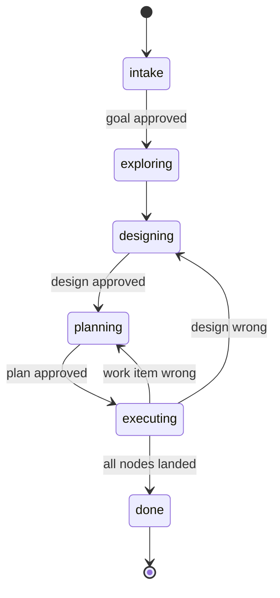
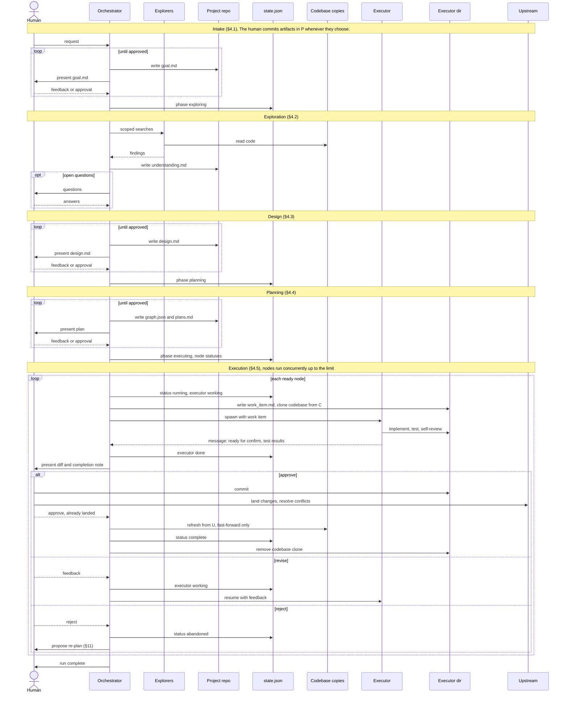
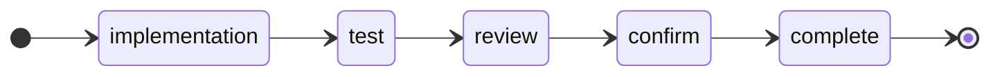
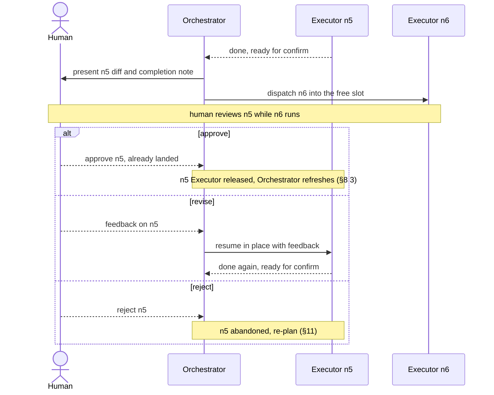

# devflow — Orchestrated Development Flow

A two-role agent architecture for taking a request from intent to landed code, with
durable state, explicit human gates, and parallel execution of independent work.

Status: **design, not implemented.** This document defines the architecture and the
contracts between components. How those components are built on Claude Code is in
[`harness.md`](./harness.md); what remains undecided is in [Open Questions](#12-open-questions).

---

## 1. Purpose

Long agent sessions fail in predictable ways: context is rebuilt from scratch on every
resume, the human approves a direction and then watches the agent drift from it, and a
single sprawling diff arrives at the end that nobody can meaningfully review.

devflow addresses those three failures with three mechanisms:

| Failure | Mechanism |
|---|---|
| Context evaporates between sessions | Every phase writes a durable artifact to disk |
| Agent drifts from the agreed direction | Every phase transition waits on explicit human approval |
| One unreviewable diff at the end | Work is decomposed into a graph of independently reviewable nodes |

This design complements, and does not replace,
[`implementation.md`](../../ai-artifacts/instructions/implementation.md). That document
already defines how a single code change must be made — scope discipline, tests within
scope, self-review, human approval on the full diff, and the human performing the commit.
devflow is the *scheduler* around that document: an Executor's lifecycle is
`implementation.md` turned into a state machine, and the Orchestrator decides which
changes exist and in what order.

---

## 2. Roles

### Orchestrator

One per project. Long-lived. The only agent that talks to the human.

Owns: the goal, context, design, the work graph, scheduling, and run state.

**Does not write production code or git history.** Its only writes are the project
artifacts (§9), `.devflow/state.json`, each node's `work_item.md`, provisioning Executor
directories (cloning a codebase in, removing it once landed), and refreshing its own
codebase copies. This is the central invariant — it keeps the Orchestrator's context
budget spent on coordination rather than implementation detail, and it means every line
of production code has passed through a node's review and confirm gates.

Its copies of the codebases are **read-only**. They change only when the Orchestrator
refreshes them to load changes the human has landed (§8.3).

### Executor

One per work node. Ephemeral, headless, no channel to the human. The Orchestrator spawns it
as a subagent and hands it the node's work item, which names its scratch directory — the
work item plus a clone of exactly one codebase (§8.1). How it is built, and how far its
confinement goes, is in [`harness.md`](./harness.md).

Owns: the implementation of exactly one node, and driving it through test and review. It
writes the code itself; for the test and review stages it starts a fresh **tester** and a
fresh **reviewer**, so tests are not self-reported and review is not self-review (§6).

**Does not commit, re-plan, or touch other nodes.** Its changes stay uncommitted in its
copy for the human to review and land. An Executor that concludes its work item is wrong
escalates to the Orchestrator rather than improvising a better plan.

Its only message to the Orchestrator is its completion status — ready for confirm, or
blocked (§7.1). It has no other channel and writes no artifact outside its scratch
directory.

### Human

Initializes the project: creates the project repository and populates the codebases
(§9). Approves the goal, the design, and the plan. Reviews each node's diff at its
confirm gate.

**Performs every git history operation** — committing the Orchestrator's artifacts in the
project repository, and committing, landing, and resolving conflicts for node changes in
the codebases.

---

## 3. Invariants

These are the properties a correct implementation must preserve. Most of the design
below follows from them.

- **I1.** The Orchestrator never edits production code.
- **I2.** Exactly one writer per file. `state.json` and `work_item.md` are
  Orchestrator-only; an Executor writes only inside its own scratch directory. No locking is required
  because no file has two writers.
- **I3.** No phase advances without explicit human approval. The phase itself is the
  record: the Orchestrator never moves on from a gate it has not been told to pass.
- **I4.** An Executor owns exactly one node and one scratch directory, and edits nothing
  outside it. For the MVP this is held by instruction, not enforced by the harness; stronger
  isolation is available when needed (harness.md §4, §7).
- **I5.** State is durable *before* the action it authorizes (write-ahead). A crash
  between "wrote intent to spawn" and "spawned" is recoverable; the reverse is not.
- **I6.** An Executor that finds its work item wrong escalates. Re-planning is an
  Orchestrator action and requires a fresh human approval.
- **I7.** Only the human writes git history, in the project repository and in every
  codebase. No agent commits, merges, rebases, or pushes.
- **I8.** The Orchestrator's codebase copies are read-only. They change only by a
  fast-forward refresh to changes the human has already landed.

---

## 4. Run Lifecycle

A **run** is one pass through this lifecycle, from intake to `done`, for one approved
goal. It has one goal, design, and work graph, and one `state.json`. Re-planning and design revisions (§11) happen *within* a run — they amend it
rather than start a new one. A project has exactly one run (§12).



Each gated phase (intake, design, planning) iterates with the human until approval; those
loops are omitted from the diagram.

### 4.1 Intake

The human describes what needs to be done. The Orchestrator restates it as `goal.md` and
iterates with the human until they agree. Cheap, and it catches the most expensive class
of error — building the wrong thing — before any tokens are spent on exploration.

`goal.md` states:

- the request, in the Orchestrator's own words
- what "done" looks like, concretely enough to check at the end of the run
- known constraints (compatibility, systems that must not change, deadlines)
- what is explicitly out of scope

**Gate: the human approves `goal.md` explicitly.** The phase advances to `exploring` only
on that approval; exploration does not begin until then.

Output: `goal.md`.

### 4.2 Exploration

The Orchestrator reads the relevant codebases from its read-only copies and writes down
what it learned. Fan-out search agents are appropriate here; their findings are distilled
into the document, not pasted into it.

Exploration is scoped by the approved goal, not exhaustive. The aim is enough context to
design, not a map of every codebase.

Output: `understanding.md` — the codebases available and what each is, architecture as
it actually is, relevant conventions, constraints discovered, and **open questions**.
Open questions are first-class; an unanswered one is a reason to talk to the human, not
to guess.

### 4.3 Design

The Orchestrator proposes a high-level design and iterates with the human. The design
answers *what* changes and *why*, and explicitly names what is out of scope.

A design is complete when it states: the approach, the alternatives rejected and why,
the components affected, the new or changed interfaces, and the non-goals.

**Gate: the human approves `design.md` explicitly.** The phase advances to `planning` only
on that approval (I3).

Output: `design.md`.

### 4.4 Planning

The Orchestrator decomposes the approved design into a directed acyclic graph of work
nodes. Node contract and sizing rules are in §5.

The plan is presented to the human in two forms: `plans.md` for reading, `graph.json` for
machines. They must agree; `plans.md` is generated from `graph.json`.

**Gate: the human approves the plan explicitly.** The phase advances to `executing` only
on that approval.

Output: `plans.md`, `graph.json`.

### 4.5 Execution

The Orchestrator schedules ready nodes, spawns Executors, relays confirm gates to the
human, refreshes its codebase copies as the human lands work, and persists state after
every transition. Detail in §6–§8.

### 4.6 Interaction Flow

End-to-end interactions across every participant in a run.

| Participant | What it is |
|---|---|
| Human | Approves gates, reviews diffs, performs all git history operations |
| Orchestrator | Coordinating agent; sole channel to the human |
| Explorers | Short-lived search agents fanned out during exploration |
| Project repo | The project directory; checked-in artifacts (§9) |
| `state.json` | Run state, in `.devflow/` |
| Codebase copies | The Orchestrator's read-only copies, in `.devflow/repos/` |
| Executor | Per-node implementing agent |
| Executor dir | The node's work item and codebase clone, in `.devflow/executors/` |
| Upstream | Wherever the human lands codebase changes; the codebase copies' remotes |



---

## 5. The Work Graph

### 5.1 Node contract

The graph lives in `graph.json` at the project root: a `version`, starting at 1 and bumped
by each approved amendment (§11), and a list of nodes. Each node declares:

| Field | Purpose |
|---|---|
| `id` | Lowercase letters, digits and hyphens. Stable for the run, never reused even after `abandoned`; also the Executor directory name |
| `repo` | The one codebase this node changes |
| `title` | One line, imperative |
| `intent` | What changes and why, in prose. The core of the Executor's work item. |
| `depends_on` | Node ids that must be landed and refreshed before this one starts |
| `files_touched` | Predicted paths/globs within `repo`. Used for sibling scheduling (§8.2), not enforcement. |
| `acceptance` | Verifiable criteria. "The endpoint returns 409 on duplicate email", not "auth works". |
| `tests` | How to verify the node: which tests or suites are relevant and how to run them, as guidance in prose. The tester chooses the exact commands. What tests to *write* follows from `acceptance`, and is the Executor's call |
| `gate` | `manual` (default) or `auto` — see §12 |

```jsonc
{
  "version": 1,
  "nodes": [
    {
      "id": "n3",
      "repo": "api",
      "title": "Extract token verification into AuthVerifier",
      "intent": "Token verification is inlined in three middleware functions with drifting behavior. Extract a single AuthVerifier class in src/auth/verifier.ts and have all three call it. No behavior change intended.",
      "depends_on": ["n1"],
      "files_touched": ["src/auth/verifier.ts", "src/auth/middleware/*.ts"],
      "acceptance": [
        "All three middleware paths call AuthVerifier.verify()",
        "An expired token yields 401 with code TOKEN_EXPIRED on all three paths"
      ],
      "tests": "The auth tests are the relevant ones (npm test -- src/auth). Run the full middleware suite too, since all three middleware paths change.",
      "gate": "manual"
    }
  ]
}
```

### 5.2 Sizing rules

A node must be **reviewable, verifiable, and incremental**. Concretely:

- **Reviewable** — one human can hold the whole diff in their head. Heuristic: ≲400
  changed lines across ≲5 files. Past that, split.
- **Verifiable** — the acceptance criteria can be checked by running something. A node
  whose criteria can only be assessed by opinion is under-specified.
- **Incremental** — the codebase is in a working state after the node lands. A node
  that leaves the build broken pending a sibling is not a node; it and its sibling are
  one node.
- **Single-repo** — a node changes exactly one codebase. A change that spans codebases is
  several nodes linked by `depends_on`.

**Splitting test:** if the node's title needs the word "and", or a reviewer would have to
mentally sort the diff into categories, split it. This is the same heuristic
`implementation.md` applies to a logical scope, because a node *is* a logical scope.

### 5.3 Graph rules

- **Validated at plan approval.** The plan is rejected if the dependencies contain a cycle,
  a dependency names an unknown id, an id is duplicated, a `repo` is not a directory in
  `.devflow/repos/`, or a node has no acceptance criteria.
- `depends_on` means "must be **landed and refreshed** into the Orchestrator's copy
  before this starts", not "must be complete". The distinction matters: a dependent
  node's codebase is cloned from that refreshed copy, so it already contains its
  dependencies and never re-does or conflicts with them.
- Nodes with no unlanded dependencies are `ready`.

---

## 6. Executor Lifecycle



The Executor does the implementation itself. The test and review stages are each performed
by an agent the Executor starts fresh for that stage, and which cannot change the code:

| Stage | Performed by | Can change code |
|---|---|---|
| implementation | the Executor | yes |
| test | a new **tester** | no — instructed not to |
| review | a new **reviewer** | no — has no tool that can |

The diagram shows the path to completion. Off that path:

| From | Back to `implementation` when | Budget | When exhausted |
|---|---|---|---|
| test | tests fail | 3 | `blocked` |
| review | the reviewer has findings | 2 | `blocked` |
| confirm | the human requests revisions | none | — |

**Every return to `implementation` means testing and reviewing again.** An edit invalidates
the tested diff, so no stage can be skipped on the way back to confirm.

An Executor also ends `blocked` if it finds its work item wrong (I6), and `abandoned` if
the human rejects the node outright at confirm.

### implementation
The Executor makes the change described by the work item, plus the tests that verify it.
Scope is the node and nothing else — discoveries outside it are reported, not fixed
(`implementation.md` §1). On later rounds it works from the test failure, the review
findings, or the human's feedback that sent it back.

### test
The Executor starts a new tester, giving it the node's `tests` guidance and, from the second
round on, the commands the previous tester ran. The tester decides what to run — at least what
the previous round covered — then:

1. hashes the clone's diff;
2. runs its chosen tests;
3. hashes the diff again, and reports pass or fail with **the exact commands it ran**, their
   output, and the hash.

A second hash that differs from the first means the tests changed the tree, which is itself a
failure. The tester changes nothing. Listing the commands keeps its freedom accountable: "tests
passed" always says what was run. A failing test is investigated and fixed by the Executor,
never disabled or weakened.

### review
The Executor starts a new reviewer, which has no tool that can change files. It reviews the
full diff against correctness, scope discipline, readability, test quality, leftovers, and
consistency (`implementation.md` §4), and reports findings. On later rounds it is also given
the earlier findings, to check they were addressed. The Executor fixes findings within scope;
findings that require leaving scope are escalated.

### confirm
The Executor **stops** and reports that it is done, carrying the tester's result and diff
hash and the reviewer's result. It cannot reach the human itself — the Orchestrator relays
(§7). On revision feedback it re-enters `implementation` with that
feedback, as many times as the human wants; on outright rejection the node is `abandoned`
and the Orchestrator escalates to re-planning.

### complete
The human landed the changes and approved at confirm (§8.3). The Executor is finished.

---

## 7. The Confirm Relay

### 7.1 Mechanism



**How the Executor signals.** It finishes, and its final message reports its completion status: the outcome
(`confirm` or `blocked`) and a **completion note** — a few lines covering the tester's result
and the diff hash it recorded, the reviewer's result, and anything the human must know to
review the diff. That is the Executor's
only channel and its only output besides the code in its clone. It writes no durable artifact
of its own. Mechanics: harness.md §3.

The Orchestrator records `executor: done` in `state.json`, then presents the diff and the
note to the human. The diff is read from the clone, so the Orchestrator's context is not
spent on implementation detail (§2). The note itself is not persisted — after a restart the
diff is re-presented without it (§10).

Nothing is reported while working — completion is the only signal. So the
Orchestrator cannot see inside a running Executor, which is why it tracks only `working` or
`done` rather than the Executor's internal phases (§6). It also means a crash loses nothing
that has to be recovered: a respawned Executor reads its clone and picks up from the code
as it stands (§10).

On revision the Executor is resumed with a message and keeps its context: it remembers work
that appears nowhere on disk. Restarting it from cold would discard everything it learned
implementing the node, which is why the relay resumes rather than respawns. The tester and
reviewer, by contrast, are always started fresh — they hold nothing worth keeping.

While `n5` awaits confirm, the Orchestrator **keeps scheduling other ready nodes** up to
the concurrency limit. Human review time overlaps with machine work rather than blocking
it. Dependents of `n5` stay `pending`, since `depends_on` requires landing.

### 7.2 What gets approved

The gate exists so that **no node finishes without explicit human approval**. The Executor
stops and waits for it; the Orchestrator does not decide on the human's behalf. Since the
human lands the change first (§8.3), the approval is the record that they reviewed it, not
a lock on code they have not seen.

The human reviews a specific diff: the codebase clone's working tree against the base
commit it was cloned at, including untracked files. Taking it against the base commit
rather than the clone's HEAD means the human committing the changes does not alter it.

**Before presenting it, the Orchestrator hashes that diff and compares it to the hash the
tester recorded.** A mismatch means the code changed after it was tested — and, since review
comes after testing, possibly after it was reviewed too. The node goes back to the Executor
without reaching the human. One check therefore guarantees that what the human sees is what
was tested and what was reviewed.

**The human lands the changes before approving** (§8.3). An approval therefore means both
"this diff is accepted" and "this diff has landed" — there is no separate state for
approved but not yet landed, and nothing to bind the approval to, since the human put the
code there themselves. Edits they make while landing, such as conflict resolution, are
theirs; the landing check in §8.3 reports what actually landed.

Because dependents wait on landing, the human's review-and-land time gates progress
through the graph.

---

## 8. Isolation and Integration

### 8.1 Codebase copies

The Orchestrator reads from its own copy of each codebase at `.devflow/repos/<repo>/`.
Each node gets a scratch directory holding its work item and a clone of the node's one
codebase:

```
.devflow/
├── repos/
│   └── <repo>/            # Orchestrator's read-only copy
└── executors/
    └── <node-id>/         # the Executor's scratch directory
        ├── work_item.md
        └── <repo>/        # clone of repos/<repo> at dispatch
```

The work item sits beside the clone rather than inside it, so it stays out of the diff under
review. The Executor is told the scratch directory's path and to stay inside it; for the MVP
nothing enforces that (harness.md §4).

The clone is taken from the Orchestrator's copy **at dispatch time**. Because dependencies
are landed and refreshed before dependents dispatch, a dependent's clone already contains
its dependencies' work.

The clone is a local `git clone`, not a worktree. A worktree writes into the source
repository's `.git` on creation and on every commit made in it, which would break the
read-only copy (I8). A local clone on the same filesystem hardlinks the object store, so
it is nearly as cheap and never writes to the source.

A node has one Executor at a time; an Executor resumed or respawned after a crash reuses the
directory and its partial work (§10).

Separate clones buy three things: concurrent edits without corruption, independent test
runs (no shared build lock or port collision), and a clean per-node diff for review.

They cost duplicated build state. `node_modules`, virtualenvs, and build caches are not
shared across clones. Mitigations, in order of preference: a shared package store
(pnpm, uv), symlinking the dependency directory into each clone at setup, or accepting
the install cost. **This is the design's main operational tax and should be measured
before committing to it** — on a codebase with a 4-minute cold install, three parallel
nodes cost 12 minutes of setup to save perhaps 20 of execution.

### 8.2 Sibling scheduling

Separate clones prevent *corruption* between parallel nodes but not *conflicts* when their
changes land. The Orchestrator therefore co-schedules siblings in the same codebase only
when their predicted `files_touched` sets are disjoint. Overlapping siblings are
serialized. Siblings in different codebases never overlap.

`files_touched` is a prediction and will sometimes be wrong. It is a scheduling heuristic,
not an enforcement boundary — a wrong prediction degrades to a conflict the human
resolves while landing (§8.3), not to corrupted state.

Concurrency limit: default 3 in-flight Executors. The binding constraint is usually the
human's review and landing throughput, not the machine's.

### 8.3 Landing and refresh

Before approving, the human **lands** the node: commits the changes in the Executor's
clone and delivers them to the branch the Orchestrator's copy tracks, by whatever git flow
they choose, resolving any conflicts along the way. devflow does not commit, merge,
rebase, or push (I7).

The approval tells the Orchestrator the node has landed. The Orchestrator:

1. Refreshes its copy of that codebase with a fast-forward-only pull. If the copy cannot
   fast-forward, it stops and surfaces the problem; it never resolves divergence itself.
2. Checks that the approved diff is present — it reverse-applies cleanly to the refreshed
   copy (`git apply --reverse --check`). This holds for squash merges and cherry-picks as
   well as plain merges. If the check fails, for example because the human changed the
   code while resolving a conflict, the Orchestrator asks the human to confirm the node
   landed.
3. Marks the node `complete`, removes the codebase clone from the Executor directory
   (keeping `work_item.md`), and recomputes which nodes are `ready`.

---

## 9. On-Disk Layout

A devflow project is a git-initialized directory that represents the project being
implemented. It is the directory the Orchestrator is started in. The Orchestrator's
artifacts live at its root and are committed by the human; everything operational lives
in `.devflow/`, which is never checked in.

```
<project>/                      # project repo: single branch, human commits
├── .gitignore                  # ignores .devflow/
├── goal.md                     # approved goal
├── understanding.md            # codebases, exploration context, open questions
├── design.md                   # approved high-level design
├── plans.md                    # human-readable execution plan (generated from graph.json)
├── graph.json                  # the DAG — machine-readable
└── .devflow/                   # temp, not checked in
    ├── state.json              # run phase + node statuses  (Orchestrator-owned)
    ├── repos/
    │   └── <repo>/             # Orchestrator's read-only codebase copy
    └── executors/
        └── <node-id>/          # one Executor's scratch directory
            ├── work_item.md    # the node contract handed to the Executor  (Orchestrator-owned)
            └── <repo>/         # the Executor's codebase clone
```

### `state.json`

The run's phase and each node's status — nothing else. It is written only by the
Orchestrator (I2).

```jsonc
{
  "phase": "executing",
  "nodes": {
    "n1": { "status": "complete", "executor": null },
    "n3": { "status": "running",  "executor": "done" },
    "n5": { "status": "running",  "executor": "working" },
    "n9": { "status": "pending",  "executor": null }
  }
}
```

**`phase`** is one of `intake`, `exploring`, `designing`, `planning`, `executing`, `done`
(§4). **`nodes`** is keyed by the ids in `graph.json` and filled in when the plan is approved.

| Status | Meaning |
|---|---|
| `pending` | Some dependency has not landed |
| `ready` | Dependencies landed; waiting for a free slot or a disjoint-file window (§8.2) |
| `running` | An Executor owns the node |
| `complete` | Landed, approved, and refreshed into the Orchestrator's copy (§8.3) |
| `blocked` | A budget ran out or the Executor escalated; dependents are blocked too |
| `abandoned` | The human rejected the node; needs a graph amendment |

**`executor`** is `working` or `done` while the node is `running`, and `null` otherwise. It
records the only two things the Orchestrator can observe of an Executor: that it has not
reported yet, or that it has. `done` means the node is waiting on the human, so it frees its
concurrency slot. The Executor's internal stage is not recorded.

**Not stored:** paths, which the layout fixes — a node's scratch directory is always
`.devflow/executors/<id>/` and its clone is `<repo>/` inside it; which Executor is working which
node, since that dies with the session (§10); and the completion note, for the same reason.

**Initialization.** The human creates the project repository and populates
`.devflow/repos/` with every codebase the project needs — directly, or from a list of
codebases checked in to the project repository. devflow does not choose or fetch
codebases on its own.

`understanding.md` is **append-only with dated entries**. Context discovered during
exploration is often invalidated during execution. Corrections reach the Orchestrator from
the human, or from its own reading of a refreshed codebase copy — not from Executors,
which only report completion (§7.1). The Orchestrator appends them rather than rewriting
history, so a resumed run can see that a belief changed and when.

Because `.devflow/` is not checked in, **execution state is local to one machine**. The
checked-in artifacts travel with the project repository; `state.json`, work items, and
in-progress clones do not. See §12.

---

## 10. Resumability

The Orchestrator is stateless between sessions; `state.json` is the sole source of truth.
On start it reads the project and `.devflow/` and reconstructs.

**A subagent that was in flight when the session died is gone, but its clone survives**, and
the clone is the work. Nothing has to be reconstructed: a replacement Executor reads the
clone to see how far things got and continues from there. It loses the dead Executor's
reasoning, not its output, so recovery can be blunt.

This is why `state.json` holds so little (§9). Which Executor is working which node is
bookkeeping the Orchestrator keeps in session: those handles are dead after a restart
anyway, so persisting them would buy nothing.

Recovery protocol, per node:

| Recorded state | Action |
|---|---|
| `pending`, `ready` | Nothing was in flight. Schedule normally. |
| `running`, executor `working` | Spawn a fresh Executor with the same work item, plus the human's feedback if it was mid-revision. It reads the clone to see how far the work got; the previous Executor's reasoning is lost, its output is not. |
| `running`, executor `done` | The completion note and its diff hash died with the session, so the diff cannot be shown with its guarantee. Start a fresh Executor told the implementation is finished: it goes straight to test and review, then confirms. If the human had already landed and approved before the crash, they say so and the Orchestrator continues with §8.3 instead. |
| `complete` | Remove the clone if it is still there. |
| `blocked`, `abandoned` | Surface to the human; do not auto-retry. |

**State is written before the action it authorizes** (I5):

- a phase advances before the next phase's work begins;
- a node is marked `running`, Executor `working`, before its Executor is started;
- Executor `done` is written before the diff is presented, and `working` before revision
  feedback is sent;
- `blocked` and `abandoned` are written before anything else is done about them;
- `complete` is written only after the refresh succeeds, and the clone is removed only after
  that.

So a crash leaves state that is either correct or conservatively stale — never ahead of
reality. Stale is cheap here: the worst case is an Executor re-doing work already sitting in
its clone.

**Writes are not atomic.** The Orchestrator rewrites the whole file with its ordinary file
tools, so a crash mid-write could leave it malformed. If `state.json` does not parse, the
Orchestrator stops and asks the human: `graph.json` and the scratch directories on disk are
enough to rebuild it by hand.

---

## 11. Failure Handling

**Node fails permanently (`blocked`).** Dependents become `blocked` transitively.
Independent branches of the graph keep running. The human is told which subtree stalled
and why.

**Work item is wrong.** The Executor escalates with what it found (I6). The Orchestrator
proposes a graph amendment. **A plan amendment requires fresh human approval** — otherwise
the approved plan and the executing plan drift apart, which is precisely the failure this
design exists to prevent.

**Design is wrong.** Rare and expensive. The run returns to `designing`. Landed nodes stay
landed; the amended plan accounts for them as existing state.

**Conflict at landing.** Resolved by the human (§8.3). devflow neither rebases the node nor
re-opens its confirm gate.

**Refresh cannot fast-forward.** The Orchestrator's copy has diverged from its upstream.
Surfaced to the human; the Orchestrator does not reset or merge its copy (I8).

---

## 12. Open Questions

1. **Isolation of a running Executor.** The MVP's Executors are subagents confined only by
   their instructions. An Executor that escapes could damage another node's clone, the
   Orchestrator's read-only copies, or the project — accepted as a known risk for the MVP, to
   be addressed if it happens. Three stronger options are described in
   harness.md §7: a hook on file-writing tools (partial — the shell bypasses it), a separate
   process rooted at the scratch directory (confines tool calls, but not processes started by
   allowed commands), and that process inside an operating-system sandbox (complete, at the cost
   of a per-toolchain binding list).

2. **`gate: auto` nodes.** The node contract reserves the field but this design treats
   every node as `manual`. Auto-gating low-risk nodes (config, mechanical renames) on
   green tests plus clean review would remove the human from the hot path where the risk
   doesn't justify them. Needs a rule for what qualifies, and it should not be the
   planning agent's unchecked judgment.

3. **The human is the intended bottleneck, by design.** Once the goal, design, and plan are
   approved, the human's remaining job is review. A 20-node run means 20 diffs reviewed and
   landed, and that is the trade being made, not a flaw to engineer around. If it becomes
   painful, the levers are batched review of independent completed nodes and, eventually,
   removing the human from low-risk nodes (item 2). Neither is designed here.

4. **Parallelism is deliberately modest.** Two or three in-flight Executors is enough;
   serializing siblings that overlap is an acceptable fallback (§8.2). Clone setup cost
   (§8.1) only needs to stay below the benefit at that small scale.

5. **Execution state is machine-local** (§9). The artifacts are checked in, but
   `.devflow/` is not, so a run cannot resume execution from a different checkout.

6. **Nested orchestration** — whether an Executor may ever spawn sub-Executors to split its
   work — is deliberately excluded. It breaks I4 and makes the state machine substantially
   harder to reason about. Revisit only with evidence of need. This is distinct from the
   tester and reviewer an Executor starts (§6): those perform fixed stages of one node's
   loop and change no code.

7. **Human-owned git (I7) is a starting policy.** It keeps agents out of history but puts
   commits, landing, and conflict resolution on the human's hot path. Open: whether to
   later let agents land clean, approved nodes, and whether anything should re-run a
   node's tests after the human resolves a conflict while landing.

8. **One run per project.** A project with a follow-up goal after `done` would need run
   identifiers in the layout (§9) and in `state.json`. Not designed until needed.

9. **Hash-bound approvals were dropped for the MVP.** Earlier drafts recorded every
   approval against a content hash, so editing an approved artifact voided it. `state.json`
   now holds only the phase and node statuses (§9). Artifact drift is still visible: the
   human commits `goal.md`, `design.md`, and `graph.json` to the project repository. Restore
   the ledger if drift turns out to happen in practice.

10. **Turning a design into a good graph is under-specified.** §5.2 gives sizing rules, but
   nothing guides decomposition itself, and the plan's quality determines everything
   downstream. Iterate on this after the MVP, with real graphs to learn from.

11. **Deterministic operations are done by instruction.** The MVP has no code of its own:
   graph validation, working out which nodes are ready, cloning, the landing sequence, and
   writes to `state.json` are all performed by the Orchestrator following its skill
   (harness.md §6). That is reliable for a handful of nodes and plainly worded steps, and
   unreliable for large graphs or long sequences. When a specific operation goes wrong in
   practice, move that operation into code — a command-line program, or an MCP server that
   would also let tools be withheld from Executors — rather than all of them at once.
