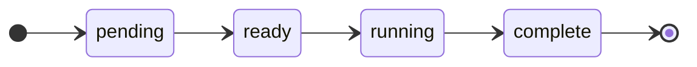

# devflow — State Schemas

Schemas for the two machine-readable files in a devflow project. Companion to
[`design.md`](./design.md).

| File | Location | Written by | Mutability |
|---|---|---|---|
| `graph.json` | Project root, checked in by the human | Orchestrator, at planning | Frozen at plan approval; changes only via an approved amendment |
| `state.json` | `.devflow/state.json`, not checked in | Orchestrator, continuously | Mutated on every transition; atomic writes |

An Executor writes neither, and writes no durable artifact of its own. Its output is the
code in its clone plus a completion message to the Orchestrator (design.md §7.1).

---

## 1. `graph.json`

The approved work graph.

```jsonc
{
  "version": 1,                         // bumped by each approved amendment
  "nodes": [
    {
      "id": "n3",
      "repo": "api",
      "title": "Extract token verification into AuthVerifier",
      "intent": "Token verification is inlined in three middleware functions with drifting behavior. Extract a single AuthVerifier class in src/auth/verifier.ts and have all three call it. No behavior change intended.",
      "depends_on": ["n1"],
      "files_touched": ["src/auth/verifier.ts", "src/auth/middleware/*.ts"],
      "acceptance": [
        "All three middleware paths call AuthVerifier.verify()",
        "An expired token yields 401 with code TOKEN_EXPIRED on all three paths",
        "No behavioral diff: existing middleware tests pass unmodified"
      ],
      "tests": "Add src/auth/__tests__/verifier.test.ts covering valid, expired, malformed, and missing tokens. Run: npm test -- src/auth",
      "gate": "manual"
    }
  ]
}
```

### Field reference

| Field | Type | Notes |
|---|---|---|
| `version` | int | Starts at 1. Incremented by an approved graph amendment (design.md §11). |
| `nodes[].id` | string | `^[a-z0-9][a-z0-9-]*$`. Stable for the life of the run; reused as the Executor directory name. Never recycled, even after `abandoned`. |
| `nodes[].repo` | string | The one codebase this node changes. Names a directory in `.devflow/repos/`. |
| `nodes[].title` | string | One imperative line. If it needs "and", the node needs splitting. |
| `nodes[].intent` | string | What changes, why, and any non-obvious constraint. The core of the node's `work_item.md`. |
| `nodes[].depends_on` | string[] | Node ids that must be **landed and refreshed** before this node dispatches. May cross codebases. Validated acyclic at approval. |
| `nodes[].files_touched` | string[] | Predicted paths or globs, relative to the root of `repo`. Scheduling heuristic only (design.md §8.2) — not enforced against the Executor. |
| `nodes[].acceptance` | string[] | Each entry independently checkable by running something. |
| `nodes[].tests` | string | What tests to add/change and the exact command to run them. |
| `nodes[].gate` | `"manual"` \| `"auto"` | Reserved. Treat every node as `manual` until the auto-gating rule exists (design.md §12, item 2). |

### Validation at plan approval

Reject the plan if any holds:

- The `depends_on` relation contains a cycle.
- Any `depends_on` names an unknown id.
- Any `id` is duplicated.
- Any `repo` does not name a directory in `.devflow/repos/`.
- Any node has an empty `acceptance` array.

---

## 2. `state.json`

Mutable run state. Orchestrator-owned, single writer, atomic replace
(`write temp → fsync → rename`).

It holds the run's phase and each node's status, and nothing else. Anything derivable, or
dead after a restart, stays out: which Executor is working which node is bookkeeping the
Orchestrator keeps in session, since those handles do not survive a crash anyway
(design.md §10).

```jsonc
{
  "phase": "executing",
  "nodes": {
    "n1": { "status": "complete", "executor": null },
    "n3": { "status": "running", "executor": "done" },
    "n5": { "status": "running", "executor": "working" },
    "n8": { "status": "blocked", "executor": null },
    "n9": { "status": "pending", "executor": null }
  }
}
```

### Run fields

| Field | Type | Notes |
|---|---|---|
| `phase` | enum | `intake` \| `exploring` \| `designing` \| `planning` \| `executing` \| `done`. Advances only on explicit human approval (design.md I3). |
| `nodes` | object | Keyed by node id, matching an id in `graph.json`. Populated when the plan is approved. |

### Node status

The Orchestrator's scheduling view.



Off that path: any status before `complete` can move to `blocked`, and a node whose
Executor is `done` moves to `abandoned` if the human rejects it outright.

| Status | Meaning |
|---|---|
| `pending` | Has dependencies that have not landed. |
| `ready` | Dependencies landed and refreshed; eligible for dispatch, waiting on a concurrency slot or a disjoint-file window (design.md §8.2). |
| `running` | An Executor owns the node. See `executor`. |
| `complete` | The human landed and approved the node, and the Orchestrator refreshed its copy (design.md §8.3). |
| `blocked` | A test or review budget was exhausted, or the Executor escalated. Dependents are transitively blocked. |
| `abandoned` | The human rejected the node outright. Requires a graph amendment to proceed. |

### `executor`

`working` \| `done` \| `null`. Non-null only while `status` is `running`.

The Orchestrator has no live channel into a running Executor, so it records only what it
observes: an Executor is `working` until it returns, and `done` once it has returned with
its completion status (design.md §7.1). Its internal phases — implementation, test,
review, confirm — are not tracked, and it sends no progress updates while working.

`done` is what the scheduler reads to know the node is waiting on the human: such a node
frees its concurrency slot, belongs in the human's review queue, and on recovery has its
diff re-presented rather than rebuilt. A revision resumes the same Executor and sets
`executor` back to `working`.

The completion note the Executor returns is relayed to the human, not stored. After a
restart the diff is re-presented without it; the diff is the reviewable thing, and it is in
the clone.

### Paths

Paths are not stored, because they are fixed by the layout (design.md §9). A node's
Executor directory is always `.devflow/executors/<id>/`, its clone is
`.devflow/executors/<id>/<repo>/`, and `<repo>` comes from the node in `graph.json`.

---

## 3. Write-Ahead Ordering

Invariant I5: state is durable before the action it authorizes. The consequence is that
recovery may find state that is *conservatively stale* — it claims an action was intended
that may not have happened — but never state that is *ahead of reality*.

| Action | Write before | Write after |
|---|---|---|
| Advance a phase on approval | `phase` | — |
| Dispatch Executor (clone, spawn) | `status=running`, `executor=working` | — |
| Present the diff to the human | `executor=done` | — |
| Resume Executor with revision feedback | `executor=working` | — |
| Mark complete after refresh | — | `status=complete`; recompute `ready` set |
| Remove clone | `status=complete` | — |
| Block or abandon | `status=blocked` \| `status=abandoned` | — |

Each row's "write before" must hit disk before the action begins. The recovery table in
design.md §10 is derived from exactly this ordering: every state it handles is one a crash
can leave behind.

Stale state is cheap. Because the clone holds the work, the worst case of a conservatively
stale record is an Executor re-reading its clone and continuing — never lost output.
